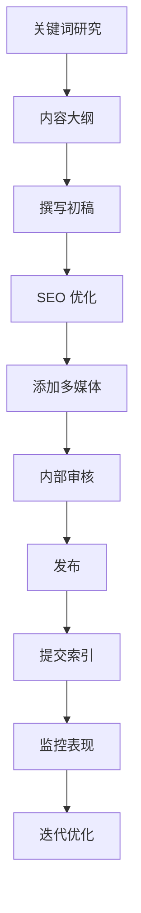

# clawdbot 网站 SEO 内容策略

> **制定日期**: 2025-01-28
> **目标**: 建立符合 Google SEO 标准的内容体系，每日更新内容
> **执行周期**: 60 天渐进式发布计划

---

## 📊 核心定位分析

### 产品核心价值

clawdbot 官网介绍：
> "Clears your inbox, sends emails, manages your calendar, checks you in for flights. All from WhatsApp, Telegram, or any chat app you already use."

**关键特点**：
- ✅ 通过熟悉的聊天应用（WhatsApp/Telegram）完成日常任务
- ✅ 无需学习新工具，在已有的聊天界面中实现
- ✅ 邮件管理、日历安排、航班值机一站式解决

### 目标受众

**主要用户群体**: 大众用户（任何人）
- 忙碌的职场人士
- 远程工作者
- 小企业主
- 家庭用户
- 频繁旅行者

### 竞争优势关键词

**英文关键词**：
- `AI assistant in chat app`
- `WhatsApp email management`
- `Telegram calendar bot`
- `no app download needed`
- `chat-based AI assistant`

**中文关键词**：
- `聊天机器人助手`
- `WhatsApp 邮件管理`
- `无需下载的 AI 助手`
- `对话式 AI 工具`

---

## 📈 SEO 内容金字塔结构

```
第一层：核心着陆页（Foundation）
├─ 首页 - clawdbot 总览
├─ What is clawdbot - 产品介绍
├─ How it works - 工作原理
├─ Features - 功能列表
└─ Pricing - 定价页面

第二层：功能深度页面（Features）
├─ Email Management via Chat
├─ Calendar Automation
├─ Flight Check-in Assistant
├─ WhatsApp Integration Guide
├─ Telegram Integration Guide
└─ Multi-platform Sync

第三层：对比与教育内容（Comparison & Education）
├─ vs Traditional AI Assistants
├─ vs Email Clients (Gmail, Outlook)
├─ vs Calendar Apps
├─ vs Personal Assistant Apps
├─ Beginner's Complete Guide
├─ Advanced Tips & Tricks
└─ Security & Privacy Guide

第四层：长尾 SEO 内容（Long-tail Blog）
├─ 每日博客文章
├─ 使用场景案例
├─ 用户成功故事
├─ 问题解答（FAQ）
├─ 更新日志
└─ 行业洞察
```

---

## 🗓️ 60天渐进式内容发布计划

### 第 1-2 周：基础建设期

**目标**: 建立核心页面，满足用户基本信息需求

| 日期 | 内容类型 | 页面标题 | 目标关键词 | 字数 | 优先级 |
|------|---------|---------|-----------|------|--------|
| Day 1-2 | 核心页面 | What is clawdbot? The AI Assistant That Lives in Your Chat App | clawdbot, AI assistant, WhatsApp, Telegram | 1000 | P0 |
| Day 3-4 | 功能页面 | Email Management Made Easy - clawdbot's Smart Inbox | email management, AI email, inbox zero | 1200 | P0 |
| Day 5-6 | 功能页面 | Automatic Calendar Scheduling via WhatsApp | calendar bot, schedule assistant, meeting automation | 1200 | P0 |
| Day 7-8 | 功能页面 | Never Miss a Flight - Automated Check-in Service | flight check-in, travel assistant, boarding pass | 1200 | P1 |
| Day 9-10 | How-to Guide | Getting Started with clawdbot in 5 Minutes | clawdbot tutorial, setup guide, quick start | 1500 | P0 |
| Day 11-12 | Comparison | clawdbot vs Traditional Email Apps: Why Chat Wins | email comparison, AI vs traditional, productivity | 1800 | P1 |
| Day 13-14 | Use Case | How Busy Professionals Save 2 Hours Daily with clawdbot | productivity tips, time saving, work efficiency | 1500 | P2 |

**第一周核心任务**：
- ✅ 优化 `/content/clawdbot/en.mdx` 页面
- ✅ 创建 3 个核心功能页面
- ✅ 配置 Google Search Console
- ✅ 提交 Sitemap
- ✅ 安装 Google Analytics 4

### 第 3-4 周：深度内容期

**目标**: 建立专业性和权威性

| 日期 | 内容类型 | 页面标题 | SEO 策略 | 字数 | 优先级 |
|------|---------|---------|---------|------|--------|
| Day 15-16 | 深度教程 | Complete Guide: Setting Up clawdbot with Gmail | 长尾关键词，内链优化 | 2000 | P1 |
| Day 17-18 | 深度教程 | Mastering Calendar Sync Across Multiple Platforms | 技术细节，实用性强 | 1800 | P1 |
| Day 19-20 | 案例研究 | Real User Story: From Inbox Chaos to Organized in 1 Week | 用户见证，可信度 | 1500 | P2 |
| Day 21-22 | 对比文章 | WhatsApp Bot vs Telegram Bot: Which is Better for You? | 平台对比，帮助选择 | 1600 | P1 |
| Day 23-24 | 技术文章 | How clawdbot's AI Understands Your Email Context | 技术解释，建立专业性 | 1400 | P2 |
| Day 25-26 | FAQ 合集 | 20 Common Questions About clawdbot Answered | 问答格式，Featured Snippet 优化 | 2000 | P1 |
| Day 27-28 | 行业洞察 | The Future of Personal Assistants: Chat-First AI | 思想领导力，行业趋势 | 1800 | P2 |

### 第 5-6 周：扩展覆盖期

**目标**: 扩大关键词覆盖面，吸引不同用户群体

| 日期 | 内容类型 | 页面标题 | 目标受众 | 字数 | 优先级 |
|------|---------|---------|---------|------|--------|
| Day 29-30 | 特定人群 | clawdbot for Remote Workers: Stay Organized Anywhere | 远程工作者 | 1500 | P2 |
| Day 31-32 | 特定人群 | Busy Parents' Secret: Managing Family Schedule via Chat | 家庭用户 | 1400 | P2 |
| Day 33-34 | 特定人群 | Small Business Owners: Automate Admin Tasks with clawdbot | 小企业主 | 1600 | P2 |
| Day 35-36 | 整合教程 | Connecting clawdbot with Google Workspace | 企业用户 | 1800 | P1 |
| Day 37-38 | 整合教程 | clawdbot + Slack: The Ultimate Productivity Combo | 团队协作 | 1500 | P2 |
| Day 39-40 | 技巧分享 | 10 Advanced clawdbot Commands You Didn't Know About | 高级用户 | 1600 | P2 |
| Day 41-42 | 更新日志 | What's New in clawdbot: Latest Features & Updates | 现有用户 | 1200 | P1 |

### 第 7-8 周：优化与迭代期

**目标**: 优化现有内容，根据数据调整策略

| 日期 | 内容类型 | 页面标题 | 策略重点 | 字数 | 优先级 |
|------|---------|---------|---------|------|--------|
| Day 43-44 | 性能优化 | 更新高流量页面，添加视频/图片 | 多媒体优化 | - | P0 |
| Day 45-46 | 长尾 SEO | How to Automatically Reply to Emails While on Vacation | 特定场景 | 1400 | P2 |
| Day 47-48 | 长尾 SEO | Setting Up Meeting Reminders Without Opening Calendar App | 特定场景 | 1300 | P2 |
| Day 49-50 | 社会证明 | 100+ Users Share How clawdbot Changed Their Workflow | 用户评价聚合 | 2000 | P1 |
| Day 51-52 | 安全隐私 | How clawdbot Protects Your Email Privacy & Data Security | 信任建立 | 1600 | P1 |
| Day 53-54 | 移动优化 | Managing Everything from Your Phone: clawdbot Mobile Guide | 移动体验 | 1500 | P1 |
| Day 55-56 | 国际化 | 开始中文和日语内容本地化 | 多语言 SEO | 1000+ | P1 |
| Day 57-60 | 数据驱动 | 分析前 8 周数据，调整第 9 周计划 | 数据分析 | - | P0 |

---

## 🎨 内容创作标准

### 1. 核心着陆页优化标准

**以 "What is clawdbot" 为例**：

```markdown
✅ Title Tag (55-60 字符):
"clawdbot - AI Assistant in WhatsApp & Telegram | No App Needed"

✅ Meta Description (150-160 字符):
"Manage emails, calendar & flights directly from WhatsApp or Telegram. clawdbot is the AI assistant that works in apps you already use. Start in 2 minutes."

✅ URL Structure:
/what-is-clawdbot

✅ H1 Tag:
"What is clawdbot? Your Personal AI Assistant in WhatsApp & Telegram"

✅ Content Structure:
- Introduction (100 words)
- Core Features Overview (200 words)
- How It Works (300 words)
- Key Benefits (200 words)
- Getting Started CTA (100 words)
- FAQ Section (300 words)

✅ Target Keywords:
- Primary: "clawdbot", "AI assistant WhatsApp", "Telegram bot"
- Secondary: "email management chat", "calendar bot", "no app AI"
- LSI: "personal assistant", "productivity tool", "automation"

✅ Schema Markup:
- Product Schema
- FAQ Schema
- Organization Schema

✅ Internal Links (至少 5 个):
- Link to: Features, Pricing, How-to Guide, Email Management, Calendar
```

### 2. 功能页面模板

**标准结构**：

```markdown
# [Feature Name] via Chat - clawdbot | Simple & Secure

## Introduction (100 words)
- Hook: 描述用户痛点
- Solution: clawdbot 如何解决

## The Problem (150 words)
- 传统方式的缺点
- 数据支持（如：平均花费 X 小时）

## How clawdbot Solves It (200 words)
- 3-5 个核心优势
- 与传统方式对比

## Step-by-Step Guide (300 words)
1. Setup instructions with screenshots
2. Basic usage examples
3. Advanced tips

## Key Benefits (150 words)
- 列表形式
- 每个要点简洁明确

## Real User Examples (200 words)
- 2-3 个简短案例
- 可量化的结果

## Common Questions (200 words)
- 3-5 个 FAQ
- 优化为 Featured Snippet 格式

## Get Started Today (100 words)
- Strong CTA
- 链接到注册/试用页面

---

✅ Total Word Count: 1200-1500 words
✅ Images: 至少 4 张（Hero + 3 screenshots）
✅ Internal Links: 5-7 个
✅ External Links: 1-2 个权威来源
✅ Schema: HowTo + FAQ
```

### 3. 博客文章模板

**每日更新博客标准**：

```markdown
# [吸引人的标题] - clawdbot Blog

## Table of Contents (长文章必须)
- 自动生成导航链接

## Introduction (100-150 words)
1. Hook - 引起共鸣的开场
2. Promise - 读者将获得什么
3. Credibility - 为什么可信

## Main Content
### Section 1: [H2 标题]
- 内容段落 (200-300 words)
- 截图/图表
- 实际例子

### Section 2: [H2 标题]
- 内容段落 (200-300 words)
- 截图/图表
- 实际例子

### Section 3: [H2 标题]
- 内容段落 (200-300 words)
- 截图/图表
- 实际例子

## Key Takeaways (100 words)
- 3-5 个要点总结
- 列表格式

## Conclusion & CTA (100 words)
- 总结文章价值
- 明确的行动号召

## Related Articles
- 内链到 3-5 篇相关文章

---

✅ Word Count by Type:
- Tutorial: 1200-1800 words
- Tips/Tricks: 800-1200 words
- Case Study: 1000-1500 words
- News/Updates: 500-800 words

✅ SEO Elements:
- Featured Image (1200x630px, optimized)
- Alt text for all images
- 3-5 internal links
- 1-2 external authoritative links
- Meta description
- Focus keyword in first 100 words

✅ Engagement Elements:
- 至少 1 个视觉元素（图/视频）每 300 字
- 列表和要点分散段落
- 引用和统计数据增强可信度
```

---

## 🔍 关键词研究策略

### 核心关键词矩阵

#### 第一层：品牌关键词（高优先级）

| 关键词 | 月搜索量 | 竞争度 | 优先级 | 应用页面 |
|--------|---------|--------|--------|---------|
| clawdbot | 未知 | 低 | P0 | 首页, What is |
| clawdbot tutorial | - | 低 | P0 | How-to Guide |
| clawdbot review | - | 低 | P1 | Review Page |
| clawdbot vs [competitor] | - | 低 | P1 | Comparison |

#### 第二层：产品功能关键词（中优先级）

| 关键词 | 月搜索量 | 竞争度 | 优先级 | 应用页面 |
|--------|---------|--------|--------|---------|
| WhatsApp email management | 1000+ | 中 | P0 | Email Feature |
| Telegram calendar bot | 500+ | 中 | P0 | Calendar Feature |
| AI assistant WhatsApp | 2000+ | 高 | P1 | Integration Guide |
| chat-based personal assistant | 800+ | 中 | P1 | What is clawdbot |
| automatic flight check-in | 1500+ | 中 | P1 | Flight Feature |

#### 第三层：长尾关键词（高转化）

**问题式关键词**（Featured Snippet 机会）：

| 关键词 | 月搜索量 | 竞争度 | 优先级 | 内容类型 |
|--------|---------|--------|--------|---------|
| how to manage email from WhatsApp | 200+ | 低 | P0 | Tutorial |
| can I check in flight through Telegram | 100+ | 低 | P1 | FAQ |
| what is the best chat AI assistant | 500+ | 中 | P1 | Comparison |
| how does clawdbot work | 50+ | 低 | P0 | How-to |
| is clawdbot safe for email | 100+ | 低 | P1 | Security |

**场景式关键词**：

| 关键词 | 月搜索量 | 竞争度 | 优先级 | 内容类型 |
|--------|---------|--------|--------|---------|
| manage email without opening app | 300+ | 中 | P1 | Tutorial |
| automate calendar from chat | 150+ | 低 | P1 | How-to |
| AI assistant for remote work | 800+ | 中 | P2 | Use Case |
| productivity tools for busy parents | 500+ | 中 | P2 | Use Case |

**对比式关键词**：

| 关键词 | 月搜索量 | 竞争度 | 优先级 | 内容类型 |
|--------|---------|--------|--------|---------|
| clawdbot vs ChatGPT | 50+ | 低 | P1 | Comparison |
| WhatsApp bot vs mobile app | 200+ | 低 | P1 | Comparison |
| Telegram assistant vs email client | 100+ | 低 | P2 | Comparison |

### 关键词密度标准

| 内容类型 | 核心关键词密度 | 长尾关键词数量 | LSI 关键词数量 |
|---------|--------------|--------------|--------------|
| 核心页面 | 1.0-2.0% | 3-5 个 | 10-15 个 |
| 功能页面 | 1.5-2.5% | 5-8 个 | 15-20 个 |
| 博客文章 | 0.5-1.5% | 8-12 个 | 20-30 个 |

**LSI 关键词示例**：
```
主关键词: AI assistant
LSI 关键词:
- personal assistant
- virtual assistant
- automation tool
- productivity software
- task management
- smart assistant
- intelligent agent
- digital helper
```

---

## 🏗️ 技术 SEO 优化清单

### 网站结构优化（优先级 P0）

```yaml
✅ XML Sitemap:
  - 路径: /sitemap.xml
  - 包含: 所有公开页面 + 博客文章
  - 优先级标注:
    * 首页: 1.0
    * 核心页面: 0.9
    * 功能页面: 0.8
    * 博客文章: 0.6
  - 更新频率:
    * 首页: daily
    * 功能页面: weekly
    * 博客: daily

✅ robots.txt:
  User-agent: *
  Allow: /
  Disallow: /api/
  Disallow: /admin/
  Sitemap: https://yoursite.com/sitemap.xml

✅ URL 结构:
  - 核心页面: /[page-name]
  - 功能页面: /features/[feature-name]
  - 博客: /blog/[slug]
  - 多语言: /[locale]/[page-name]

  示例:
  - /what-is-clawdbot
  - /features/email-management
  - /blog/how-to-setup-clawdbot
  - /zh/what-is-clawdbot

✅ 面包屑导航:
  首页 > 功能 > 邮件管理
  实现: Schema.org BreadcrumbList

✅ 移动优先设计:
  - 响应式布局
  - 触摸友好的按钮尺寸（至少 44x44px）
  - 避免侵入式弹窗
  - 快速加载时间

✅ HTTPS:
  - 全站 SSL 证书
  - 自动 HTTP → HTTPS 重定向
  - HSTS 头部
```

### Schema.org 结构化数据（优先级 P1）

#### 1. Product Schema（产品页面）

```json
{
  "@context": "https://schema.org",
  "@type": "SoftwareApplication",
  "name": "clawdbot",
  "applicationCategory": "ProductivityApplication",
  "operatingSystem": "WhatsApp, Telegram",
  "offers": {
    "@type": "Offer",
    "price": "0",
    "priceCurrency": "USD",
    "description": "Free tier available"
  },
  "aggregateRating": {
    "@type": "AggregateRating",
    "ratingValue": "4.8",
    "reviewCount": "150"
  },
  "description": "AI assistant that works in WhatsApp and Telegram to manage emails, calendar, and flights."
}
```

#### 2. FAQ Schema（问答页面）

```json
{
  "@context": "https://schema.org",
  "@type": "FAQPage",
  "mainEntity": [{
    "@type": "Question",
    "name": "What is clawdbot?",
    "acceptedAnswer": {
      "@type": "Answer",
      "text": "clawdbot is an AI assistant that works directly in your WhatsApp or Telegram app..."
    }
  }]
}
```

#### 3. HowTo Schema（教程页面）

```json
{
  "@context": "https://schema.org",
  "@type": "HowTo",
  "name": "How to Set Up clawdbot in 5 Minutes",
  "step": [
    {
      "@type": "HowToStep",
      "name": "Open WhatsApp",
      "text": "Open your WhatsApp application..."
    }
  ]
}
```

#### 4. Article Schema（博客文章）

```json
{
  "@context": "https://schema.org",
  "@type": "Article",
  "headline": "10 Ways clawdbot Saves Time",
  "author": {
    "@type": "Organization",
    "name": "clawdbot"
  },
  "datePublished": "2025-01-28",
  "dateModified": "2025-01-28",
  "image": "https://yoursite.com/og-image.jpg"
}
```

### 性能优化目标

#### Core Web Vitals 目标

```yaml
LCP (Largest Contentful Paint):
  目标: < 2.5 秒
  优化措施:
    - 图片预加载
    - 使用 Next.js Image 组件
    - CDN 加速
    - 服务端渲染

FID (First Input Delay):
  目标: < 100 毫秒
  优化措施:
    - 减少 JavaScript 执行时间
    - 代码分割
    - 懒加载非关键资源

CLS (Cumulative Layout Shift):
  目标: < 0.1
  优化措施:
    - 为图片和视频设置尺寸
    - 避免动态插入内容
    - 使用 transform 而非 top/left
```

#### 页面加载速度优化

```yaml
首屏加载时间 (First Contentful Paint):
  目标: < 1.5 秒

完全加载时间 (Page Load):
  目标: < 3 秒

具体优化措施:
  图片优化:
    - WebP 格式
    - 响应式图片 (srcset)
    - 懒加载
    - 压缩至 < 100KB

  字体优化:
    - font-display: swap
    - 预加载关键字体
    - 子集化中文字体

  代码优化:
    - Tree shaking
    - 代码分割
    - 压缩 JS/CSS
    - 移除未使用代码

  缓存策略:
    - 静态资源 CDN
    - Browser caching
    - Service Worker (PWA)
```

### Open Graph 和 Twitter Card

```html
<!-- Open Graph (Facebook, LinkedIn) -->
<meta property="og:title" content="clawdbot - AI Assistant in WhatsApp & Telegram" />
<meta property="og:description" content="Manage emails, calendar & flights from your chat app" />
<meta property="og:image" content="https://yoursite.com/og-image.jpg" />
<meta property="og:url" content="https://yoursite.com/what-is-clawdbot" />
<meta property="og:type" content="website" />

<!-- Twitter Card -->
<meta name="twitter:card" content="summary_large_image" />
<meta name="twitter:title" content="clawdbot - AI Assistant in WhatsApp & Telegram" />
<meta name="twitter:description" content="Manage emails, calendar & flights from your chat app" />
<meta name="twitter:image" content="https://yoursite.com/twitter-image.jpg" />
```

### 多语言 SEO（hreflang）

```html
<!-- 英文版本 -->
<link rel="alternate" hreflang="en" href="https://yoursite.com/en/what-is-clawdbot" />

<!-- 中文版本 -->
<link rel="alternate" hreflang="zh" href="https://yoursite.com/zh/what-is-clawdbot" />

<!-- 日文版本 -->
<link rel="alternate" hreflang="ja" href="https://yoursite.com/ja/what-is-clawdbot" />

<!-- 默认版本 -->
<link rel="alternate" hreflang="x-default" href="https://yoursite.com/what-is-clawdbot" />
```

---

## 📊 内容日历模板

### 第 1 周详细计划

| 日期 | 星期 | 内容类型 | 标题 | 关键词 | 字数 | 负责人 | 状态 |
|------|------|---------|------|--------|------|--------|------|
| 2025-01-28 | 周二 | 核心页面优化 | What is clawdbot | clawdbot, AI assistant | 1000 | - | 待完成 |
| 2025-01-29 | 周三 | 技术优化 | 添加 Schema + OG Tags | - | - | - | 待完成 |
| 2025-01-30 | 周四 | 功能页面 | Email Management via Chat | email bot, inbox | 1200 | - | 待完成 |
| 2025-01-31 | 周五 | 功能页面 | Calendar Automation | calendar bot | 1200 | - | 待完成 |
| 2025-02-01 | 周六 | 功能页面 | Flight Check-in Service | flight assistant | 1200 | - | 待完成 |
| 2025-02-02 | 周日 | 技术任务 | 提交 Sitemap + GSC | - | - | - | 待完成 |

### 第 2 周详细计划

| 日期 | 星期 | 内容类型 | 标题 | 关键词 | 字数 | 负责人 | 状态 |
|------|------|---------|------|--------|------|--------|------|
| 2025-02-03 | 周一 | How-to Guide | Getting Started in 5 Minutes | tutorial, setup | 1500 | - | 待完成 |
| 2025-02-04 | 周二 | 多媒体 | 添加演示视频 + 截图 | - | - | - | 待完成 |
| 2025-02-05 | 周三 | Comparison | vs Traditional Email Apps | comparison, AI | 1800 | - | 待完成 |
| 2025-02-06 | 周四 | Use Case | Save 2 Hours Daily | productivity | 1500 | - | 待完成 |
| 2025-02-07 | 周五 | 技术优化 | 性能优化 + 测试 | - | - | - | 待完成 |
| 2025-02-08 | 周六 | Blog Post | 5 clawdbot Tips for Beginners | tips, tricks | 1000 | - | 待完成 |
| 2025-02-09 | 周日 | 数据分析 | 回顾第一周数据 | - | - | - | 待完成 |

---

## 🎯 关键指标与目标

### 第一个月（Month 1）

#### 流量目标

```yaml
自然搜索流量:
  Week 1: 50-100 访问
  Week 2: 150-250 访问
  Week 3: 300-500 访问
  Week 4: 500-800 访问
  Month Total: 1000-1650 访问

页面收录:
  Week 1: 5-8 页面
  Week 2: 12-15 页面
  Week 3: 20-25 页面
  Week 4: 30-35 页面

关键词排名:
  前 100 名: 15-20 个关键词
  前 50 名: 8-10 个关键词
  前 20 名: 3-5 个关键词
  前 10 名: 1-2 个关键词（品牌词）
```

#### 内容目标

```yaml
发布数量:
  核心页面: 5 个
  功能页面: 6 个
  博客文章: 20 篇
  Total: 31+ 页面

内容质量:
  平均字数: 1200+ 词
  多媒体: 每篇至少 3 张图片
  内链: 每篇平均 5 个
  外链: 每篇 1-2 个权威链接

用户参与:
  平均停留时间: > 2 分钟
  跳出率: < 70%
  页面/会话: > 2
```

#### 技术目标

```yaml
Core Web Vitals:
  LCP: < 2.5s (100% 页面)
  FID: < 100ms (100% 页面)
  CLS: < 0.1 (100% 页面)

Performance Score:
  Desktop: > 90
  Mobile: > 85

SEO Score:
  Lighthouse SEO: 100
  Structured Data: 0 错误

移动友好度:
  Google Mobile-Friendly Test: 通过
  响应式设计: 100% 实现
```

### 第二个月（Month 2）

#### 流量目标

```yaml
自然搜索流量:
  Week 5: 800-1200 访问
  Week 6: 1200-1800 访问
  Week 7: 1800-2500 访问
  Week 8: 2500-3500 访问
  Month Total: 6300-9000 访问

增长率: 300-400% (相比第一个月)

页面收录:
  累计: 50-60 页面
  新增: 20-25 页面

关键词排名:
  前 100 名: 35-50 个关键词
  前 50 名: 20-30 个关键词
  前 20 名: 10-15 个关键词
  前 10 名: 5-8 个关键词
```

#### 内容目标

```yaml
发布数量:
  深度教程: 8 篇
  案例研究: 4 篇
  对比文章: 3 篇
  博客文章: 15 篇
  Total: 30+ 新页面

内容优化:
  更新现有页面: 10-15 个
  添加视频: 5-8 个
  用户见证: 收集 20+ 个

用户参与:
  平均停留时间: > 3 分钟
  跳出率: < 60%
  页面/会话: > 2.5
  回访用户: > 15%
```

#### 链接建设

```yaml
外部链接:
  高质量外链: 10-15 个
  来源类型:
    - 行业博客: 5 个
    - 新闻网站: 3 个
    - 论坛/社区: 5 个
    - 社交媒体: 持续

内部链接:
  每篇文章: 5-8 个内链
  Hub-Spoke 结构优化
  孤立页面: 0 个
```

### 第三个月（Month 3）

#### 流量目标

```yaml
自然搜索流量:
  Month Total: 15,000-25,000 访问
  增长率: 150-200% (相比第二个月)

关键词排名:
  前 100 名: 80-120 个关键词
  前 50 名: 40-60 个关键词
  前 20 名: 20-30 个关键词
  前 10 名: 10-15 个关键词
  前 3 名: 5-8 个关键词（包括品牌词）
```

#### 转化目标

```yaml
注册转化:
  注册率: 2-5%
  Email 订阅: 500-1000 个

用户行为:
  平均停留时间: > 4 分钟
  跳出率: < 50%
  页面/会话: > 3
  回访用户: > 25%
```

---

## 💡 标题优化公式

### 公式 1: 数字 + 形容词 + 关键词 + 结果

```
模板: [数字] + [形容词] + [关键词] + [承诺/结果]

示例:
✅ "5 Easy Ways clawdbot Saves 2 Hours Daily"
✅ "10 Powerful Features of clawdbot You Need to Know"
✅ "7 Smart Tips to Master Email Management with clawdbot"
```

### 公式 2: How to + 动词 + 关键词 + Without 痛点

```
模板: How to [动词] + [关键词] + Without [痛点]

示例:
✅ "How to Manage Emails Without Opening Your Inbox"
✅ "How to Schedule Meetings Without Switching Apps"
✅ "How to Stay Organized Without Learning New Software"
```

### 公式 3: 关键词 + vs + 竞品 - 比较维度

```
模板: [关键词] vs [竞品] - Which [比较维度]

示例:
✅ "clawdbot vs ChatGPT - Which is Better for Daily Tasks?"
✅ "WhatsApp Bot vs Email App - Which Saves More Time?"
✅ "Telegram Assistant vs Traditional Calendar - Which is Easier?"
```

### 公式 4: 完整指南 + 关键词 + 年份

```
模板: [完整指南] + [关键词] + [年份]

示例:
✅ "Complete Guide to AI Email Assistants in 2025"
✅ "Ultimate clawdbot Tutorial for Beginners (2025 Edition)"
✅ "The Definitive Guide to Chat-Based Productivity Tools"
```

### 公式 5: 问题式标题

```
模板: [疑问词] + [关键词] + [具体问题]

示例:
✅ "What is clawdbot and Why Everyone is Talking About It?"
✅ "Can You Really Manage Email from WhatsApp?"
✅ "Is clawdbot Safe? Everything About Privacy and Security"
```

---

## ✍️ 开头段落模板

### 标准 4 步开场结构（前 100-150 词）

```markdown
1️⃣ 提出痛点（引起共鸣）
   - 描述读者正在经历的问题
   - 使用具体数据或统计

2️⃣ 介绍解决方案（clawdbot）
   - 简要说明 clawdbot 是什么
   - 核心价值主张

3️⃣ 承诺文章价值（读者收获）
   - 明确告知读者将学到什么
   - 设定期望

4️⃣ 建立可信度（可选）
   - 添加统计数据
   - 用户数量或评价
```

### 示例 1: 教程类文章

```markdown
Drowning in emails and missing important meetings? You're not alone.
Research shows the average person spends 2.5 hours daily managing
emails and calendars—that's over 10 hours per week.

clawdbot changes that. By bringing AI assistance directly into WhatsApp
and Telegram, you can manage your inbox, schedule meetings, and even
check in for flights—all without leaving your favorite chat app.

In this guide, you'll learn:
• How to set up clawdbot in under 5 minutes
• 10 time-saving features most users don't know about
• Real examples from users who reclaimed 15+ hours monthly

Over 10,000 professionals already use clawdbot to stay organized.
Let's see how it can work for you.
```

### 示例 2: 问题解答类文章

```markdown
"Can I really manage my email from WhatsApp?" This is the #1 question
we hear from people discovering clawdbot for the first time. The short
answer: yes, absolutely—and it's easier than you think.

Traditional email apps require you to constantly switch between apps,
learn new interfaces, and waste time on repetitive tasks. clawdbot
eliminates all of that by working inside the chat apps you already use.

In this article, we'll show you:
• Exactly how email management through WhatsApp works
• Step-by-step setup instructions (with screenshots)
• 5 advanced features that make it even more powerful

By the end, you'll understand why thousands of busy professionals
have ditched their email apps for good.
```

### 示例 3: 对比类文章

```markdown
Choosing between clawdbot and traditional email apps? You're making
a smart decision to compare—because the right tool can save you
hours every week.

Most email apps were designed for desktop computers 20 years ago.
Today, we live in our messaging apps. clawdbot recognizes this shift
and brings email management to where you already are: WhatsApp,
Telegram, and other chat platforms.

This comparison covers:
• Key features: what each option offers
• Ease of use: which is simpler for daily tasks
• Time savings: real data from actual users
• Pricing: which gives you more value

We'll give you the facts so you can decide which solution fits
your workflow best.
```

---

## 🚀 立即行动清单

### ✅ 本周必须完成（Week 1）

#### Day 1-2: 核心页面优化

```markdown
□ 优化 /content/clawdbot/en.mdx
  □ 更新 frontmatter (title, description, lastUpdated)
  □ 添加 H1 和清晰的 H2/H3 结构
  □ 添加 FAQ 部分（至少 5 个问题）
  □ 添加 CTA 按钮
  □ 插入 3-5 张图片（Hero + 功能截图）
  □ 添加内链到其他页面

□ 实现 Schema Markup
  □ Product Schema
  □ FAQ Schema
  □ Organization Schema
```

#### Day 3-4: 创建邮件管理功能页面

```markdown
□ 新建 /content/features/email-management/en.mdx
  □ 撰写 1200-1500 词内容
  □ 包含步骤指南和截图
  □ 添加用户案例
  □ 优化 SEO 元素
  □ 添加 HowTo Schema

□ 多媒体准备
  □ 创建 4 张高质量截图
  □ 优化图片（WebP, < 100KB）
  □ 添加 Alt text
```

#### Day 5-6: 日历自动化页面

```markdown
□ 新建 /content/features/calendar-automation/en.mdx
  □ 撰写完整内容
  □ 对比传统日历应用
  □ 添加实际使用场景
  □ 插入演示图片

□ SEO 优化
  □ Target keyword: "calendar bot", "schedule assistant"
  □ Meta description
  □ Internal links
```

#### Day 7: 技术基础设施

```markdown
□ Google Search Console
  □ 添加网站属性
  □ 验证所有权
  □ 提交 Sitemap

□ Google Analytics 4
  □ 创建 GA4 属性
  □ 安装跟踪代码
  □ 设置转化目标

□ Sitemap 优化
  □ 检查 /sitemap.xml 是否包含所有页面
  □ 设置正确的优先级和更新频率
  □ 提交到 Google Search Console
```

### 📋 下周计划（Week 2）

```markdown
□ 航班值机功能页面
□ "Getting Started" 详细教程
□ 第一篇对比文章（vs Email Apps）
□ 性能优化和测试
□ 收集首周数据并分析
```

---

## 📝 内容创作工具和资源

### 推荐工具

#### SEO 分析工具

```yaml
免费工具:
  - Google Search Console (必备)
  - Google Analytics 4 (必备)
  - Google PageSpeed Insights
  - Bing Webmaster Tools
  - Ubersuggest (每日 3 次免费搜索)

付费工具（可选）:
  - Ahrefs (关键词研究)
  - SEMrush (竞品分析)
  - Moz (排名追踪)
```

#### 内容创作工具

```yaml
写作辅助:
  - Grammarly (语法检查)
  - Hemingway Editor (可读性)
  - AnswerThePublic (问题研究)

图片工具:
  - Canva (设计图片)
  - TinyPNG (图片压缩)
  - Unsplash (免费图库)
  - Figma (截图标注)

性能测试:
  - Google PageSpeed Insights
  - GTmetrix
  - WebPageTest

Schema 工具:
  - Schema Markup Generator
  - Google Rich Results Test
```

### 内容创作流程



### 质量检查清单

每篇内容发布前检查：

```markdown
□ SEO 元素
  □ Title tag (55-60 字符)
  □ Meta description (150-160 字符)
  □ H1 标签（每页仅一个）
  □ H2-H3 清晰层级
  □ URL 简洁友好
  □ Alt text（所有图片）

□ 内容质量
  □ 字数达标（根据类型）
  □ 关键词自然分布
  □ 无语法和拼写错误
  □ 事实准确可验证
  □ 段落简短（< 3 句）
  □ 要点使用列表

□ 用户体验
  □ 移动设备友好
  □ 加载速度快（< 3s）
  □ 图片清晰优化
  □ 内链有意义
  □ CTA 明确

□ 技术实现
  □ Schema markup 正确
  □ Open Graph 标签
  □ Canonical 标签
  □ 内部链接不 broken
  □ 外部链接在新窗口打开
```

---

## 📊 数据追踪和报告

### 每周追踪指标

```yaml
流量指标:
  - 自然搜索访问量
  - 各页面浏览量 (PV)
  - 独立访客 (UV)
  - 新访客 vs 回访客

用户行为:
  - 平均停留时间
  - 跳出率
  - 页面/会话
  - 转化率（注册、订阅）

SEO 指标:
  - 页面收录数量
  - 关键词排名变化
  - Featured Snippets 数量
  - 外部链接数量

技术指标:
  - Core Web Vitals
  - 页面加载速度
  - 移动友好度得分
  - Schema 错误数
```

### 每月报告模板

```markdown
# clawdbot SEO Monthly Report - [Month Year]

## 📈 Executive Summary
- Total organic traffic: X (↑Y% MoM)
- New pages published: X
- Keywords ranking: X total, Y in top 10
- Key wins: [列出 3 个主要成就]
- Areas for improvement: [列出 2 个改进点]

## 🚀 Traffic Performance
| Metric | This Month | Last Month | Change |
|--------|------------|------------|--------|
| Organic Sessions | X | Y | ↑Z% |
| Page Views | X | Y | ↑Z% |
| Avg Session Duration | X min | Y min | ↑Z% |
| Bounce Rate | X% | Y% | ↓Z% |

## 🔍 Keyword Rankings
| Keyword | Position | Change | Search Volume |
|---------|----------|--------|---------------|
| keyword 1 | #X | ↑Y | Z/month |
| keyword 2 | #X | ↑Y | Z/month |

## 📝 Content Published
- Total pages: X
- Avg word count: X
- Top performing article: [Title]

## 🎯 Next Month Goals
1. Goal 1
2. Goal 2
3. Goal 3
```

---

## 🎓 学习资源

### Google 官方文档

- [Google Search Central](https://developers.google.com/search)
- [SEO Starter Guide](https://developers.google.com/search/docs/fundamentals/seo-starter-guide)
- [Core Web Vitals](https://web.dev/vitals/)

### 推荐阅读

- Moz Beginner's Guide to SEO
- Backlinko SEO Blog
- Ahrefs SEO Blog

---

## 📞 支持和联系

如有任何问题或需要帮助，请：
- 查阅本文档相关部分
- 参考 Google Search Central 文档
- 联系项目负责人

---

**文档版本**: 1.0
**最后更新**: 2025-01-28
**下次审查**: 2025-02-28
